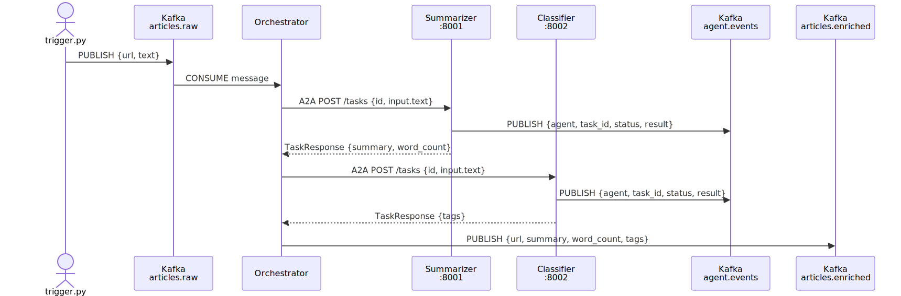

# Architecture

## Overview

This system implements a **hybrid Kafka + A2A communication pattern** for multi-agent pipelines.

- **Apache Kafka** acts as the async event transport: durable, replayable, decoupled.
- **A2A Protocol** (Google's Agent-to-Agent spec) acts as the agent interface layer: structured task contracts, lifecycle tracking, and agent discovery via Agent Cards.

Each protocol handles what it is best at. Kafka moves events between systems; A2A defines what agents can do and how to invoke them.

---

## System Diagram

---

## Kafka Topics

| Topic | Producer | Consumer | Purpose |
|---|---|---|---|
| `articles.raw` | `trigger.py` | Orchestrator | Pipeline entry point |
| `articles.enriched` | Orchestrator | Any downstream system | Final enriched output |
| `agent.events` | Summarizer, Classifier | Observability / audit | Record of every completed agent task |

---

## Agent Roles

### Orchestrator
- **No A2A server** — it is a pure Kafka consumer and A2A client.
- Polls `articles.raw`, delegates sub-tasks to specialist agents via A2A, merges results, and publishes to `articles.enriched`.
- Env vars: `SUMMARIZER_URL`, `CLASSIFIER_URL`, `KAFKA_BOOTSTRAP`.

### Summarizer (port 8001)
- Exposes an A2A HTTP server.
- Accepts `POST /tasks` with article text; returns a 2-sentence summary and word count.
- After each task, emits an audit event to `agent.events`.
- **Stub function to replace:** `_summarize()` in `agents/summarizer/main.py`.

### Classifier (port 8002)
- Exposes an A2A HTTP server.
- Accepts `POST /tasks` with article text; returns a list of topic tags.
- After each task, emits an audit event to `agent.events`.
- **Stub function to replace:** `_classify()` in `agents/classifier/main.py`.

---

## Sequence Diagram

