# Data Model

All models are defined in `shared/a2a_models.py` using Pydantic v2.



---

## A2A Models

### TaskRequest
Sent by the Orchestrator to a specialist agent via `POST /tasks`.

```json
{
  "id": "3f7a1c2e-84b0-4d9f-a123-000000000001",
  "input": {
    "text": "OpenAI released a new model today. The model uses advanced machine learning algorithms."
  }
}
```

| Field | Type | Description |
|---|---|---|
| `id` | `string (UUID)` | Caller-generated unique task ID. Used to correlate the Kafka audit event with the A2A call. |
| `input.text` | `string` | Article text to process. |

---

### TaskResponse
Returned synchronously by the specialist agent.

```json
{
  "id": "3f7a1c2e-84b0-4d9f-a123-000000000001",
  "status": "completed",
  "result": { ... },
  "error": null
}
```

| Field | Type | Description |
|---|---|---|
| `id` | `string (UUID)` | Echoes the request ID. |
| `status` | `enum` | `submitted` / `working` / `completed` / `failed` |
| `result` | `object \| null` | Agent-specific result payload (see below). |
| `error` | `string \| null` | Error message when status is `failed`. |

---

### AgentCard
Served at `GET /.well-known/agent.json` on each specialist agent. Used for discovery.

```json
{
  "name": "summarizer",
  "description": "Returns a 2-sentence summary and word count from article text",
  "version": "0.1.0",
  "url": "http://localhost:8001",
  "skills": ["summarize"],
  "input_schema": {
    "type": "object",
    "properties": { "text": { "type": "string" } }
  },
  "output_schema": {
    "type": "object",
    "properties": {
      "summary": { "type": "string" },
      "word_count": { "type": "integer" }
    }
  }
}
```

---

## Kafka Message Payloads

### `articles.raw` — Pipeline trigger

Published by `trigger.py`.

```json
{
  "url": "https://example.com/ai-news",
  "text": "OpenAI released a new model today. The model uses advanced machine learning algorithms."
}
```

| Field | Type | Kafka Key |
|---|---|---|
| `url` | `string` | Yes — used as the partition key |
| `text` | `string` | — |

---

### `articles.enriched` — Final output

Published by the Orchestrator after both A2A calls complete.

```json
{
  "url": "https://example.com/ai-news",
  "summary": "OpenAI released a new model today. The model uses advanced machine learning algorithms.",
  "word_count": 15,
  "tags": ["tech"]
}
```

| Field | Type | Source |
|---|---|---|
| `url` | `string` | Passed through from `articles.raw` |
| `summary` | `string` | Summarizer agent result |
| `word_count` | `integer` | Summarizer agent result |
| `tags` | `string[]` | Classifier agent result |

---

### `agent.events` — Audit trail

Published by Summarizer and Classifier after each completed A2A task.

```json
{
  "agent": "summarizer",
  "task_id": "3f7a1c2e-84b0-4d9f-a123-000000000001",
  "status": "completed",
  "result": {
    "summary": "OpenAI released a new model today. The model uses advanced machine learning algorithms.",
    "word_count": 15
  }
}
```

| Field | Type | Kafka Key |
|---|---|---|
| `agent` | `string` | — |
| `task_id` | `string (UUID)` | Yes — correlates with the A2A `TaskRequest.id` |
| `status` | `string` | — |
| `result` | `object` | Agent-specific (same as `TaskResponse.result`) |

> **Tip:** Use `task_id` to correlate `agent.events` messages with A2A calls in the Orchestrator logs for end-to-end tracing.

---

## Data Flow Summary


