# How It Works

## The Two Protocols and Why Both

This system uses two complementary protocols, each handling the layer it is best suited for.

| Layer | Protocol | Responsibility |
|---|---|---|
| **Transport** | Apache Kafka | Moving events reliably across the system; durability; fan-out; audit trail |
| **Interface** | A2A | Defining what each agent can do; structured task contracts; lifecycle tracking |

Neither protocol alone is sufficient:
- Kafka has no concept of an "agent" or a "task" — it only moves bytes between topics.
- A2A has no persistence — if the receiver is down, the message is lost.

Together, Kafka provides the backbone and A2A provides the structure.

---

## Step-by-Step Pipeline Walkthrough


### Step 1 — Trigger
`trigger.py` publishes a JSON message to the `articles.raw` Kafka topic. The message contains a URL and raw article text. This is the pipeline's entry point — the only human-facing action needed to start the flow.

### Step 2 — Orchestrator wakes up
The Orchestrator is a long-running process that polls `articles.raw` via a Kafka consumer loop. When it receives a message, it begins coordinating the pipeline synchronously.

The Orchestrator does **not** process the article itself — it only delegates. This separation of concerns is the core of the architecture.

### Step 3 — A2A call to Summarizer
The Orchestrator generates a UUID and calls `POST http://localhost:8001/tasks` (A2A) with the article text. This is a synchronous HTTP call — the Orchestrator waits for the result.

The Summarizer:
1. Receives the `TaskRequest`
2. Runs `_summarize(text)` (stub → LLM-ready)
3. Publishes a completed event to `agent.events` (Kafka)
4. Returns a `TaskResponse` with `{ summary, word_count }`

### Step 4 — A2A call to Classifier
The Orchestrator calls `POST http://localhost:8002/tasks` with the same article text. Same pattern as above.

The Classifier:
1. Receives the `TaskRequest`
2. Runs `_classify(text)` (stub → LLM-ready)
3. Publishes a completed event to `agent.events` (Kafka)
4. Returns a `TaskResponse` with `{ tags }`

### Step 5 — Merge and publish
The Orchestrator merges both results into an enriched article object and publishes it to `articles.enriched` (Kafka). Any downstream system — a database writer, a notification agent, a search indexer — can independently consume this topic.

---

## Why Agents Also Write to Kafka

The specialist agents are not passive HTTP servers. After completing each A2A task, they publish an event to `agent.events`. This is intentional and important:

- **Decoupling**: Any system can consume `agent.events` without knowing about the Orchestrator.
- **Observability**: Every agent action is recorded with its task ID, result, and timestamp.
- **Replay**: If a bug is discovered, events can be replayed from any offset.
- **Future fan-out**: A new agent can subscribe to `agent.events` and react to completions without modifying existing agents.

---

## Why A2A Instead of Direct HTTP

The Orchestrator could call the agents with plain `httpx.post()` and skip A2A entirely. A2A adds two concrete things:

1. **Agent Cards** (`GET /.well-known/agent.json`) — each agent declares its name, skills, input/output schema, and URL. An orchestrator can discover and validate agents at runtime without hardcoded knowledge.

2. **Task lifecycle** — the `TaskRequest` / `TaskResponse` contract standardizes how tasks are submitted and how results are returned. When `_summarize()` is replaced with an async LLM call, the A2A task status gives the orchestrator a structured way to track long-running work.



---

## The Stub Functions

Each specialist agent has one function designed to be replaced with an LLM call:

```
agents/summarizer/main.py  →  _summarize(text: str) -> dict
agents/classifier/main.py  →  _classify(text: str) -> dict
```

Both have the same signature: they receive a string and return a dict. No other code needs to change. To add an LLM call, import your client and replace the function body.

---

## Enrichment Path

The skeleton is designed to grow in layers without rewiring the core:

| Addition | Where to change |
|---|---|
| LLM summarization | `_summarize()` in `agents/summarizer/main.py` |
| LLM classification | `_classify()` in `agents/classifier/main.py` |
| New specialist agent | New FastAPI app + subscribe to a topic or expose `/tasks` |
| Retry on A2A failure | Wrap `call_a2a()` in try/except; publish to `agent.errors` |
| Async orchestrator | Replace blocking poll with `AIOKafkaConsumer` + `asyncio.run()` |
| Schema governance | Add Avro/Protobuf serialization in `shared/kafka_utils.py` |
| Cross-org agents | Point `SUMMARIZER_URL` / `CLASSIFIER_URL` to external A2A-compliant agents |
