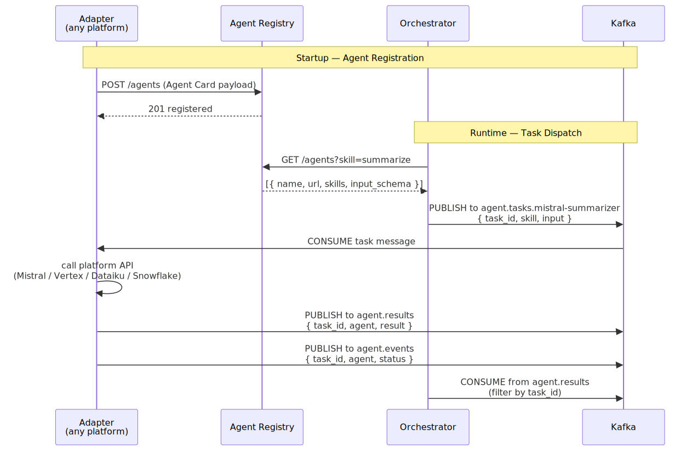

# Multi-Platform Agent Integration: Kafka + A2A

## The Short Answer

**Yes** — Kafka works as a universal message bus between agents from any platform. Because Kafka is protocol-agnostic (it just moves bytes), any system that can make HTTP calls can integrate with it via a thin adapter layer. A2A then provides the identity and discovery layer on top: each platform agent gets an **Agent Card** that declares who it is, what it can do, and how to call it.

---

## Core Architecture



The architecture has three layers:

| Layer | What it does | Who owns it |
|---|---|---|
| **External Platforms** | Run the AI (Mistral, Vertex AI, Dataiku, Snowflake) | Platform vendors |
| **Adapter Layer** | Bridges each platform to Kafka + A2A | You (thin wrappers) |
| **Kafka + Registry** | Routes messages and stores agent identities | Your infrastructure |

The key insight: **you never modify the platform agents**. You write one thin adapter per platform that translates between Kafka messages and that platform's API. The adapter also serves as the A2A endpoint for the agent.

---

## The Adapter Pattern

Every external platform agent gets a single adapter service that does four things:



1. **Serves an Agent Card** at `GET /.well-known/agent-card.json` — this is the agent's identity
2. **Accepts A2A tasks** at `POST /tasks` — for direct synchronous delegation
3. **Consumes from a dedicated Kafka topic** — for async dispatch (`agent.tasks.<name>`)
4. **Publishes to Kafka** — results to `agent.results`, audit events to `agent.events`

This means each adapter can be called **either synchronously (A2A)** or **asynchronously (Kafka)** — the Orchestrator chooses based on latency requirements.

---

## How Agents Identify Each Other: A2A Agent Cards + Registry

### Agent Card

Every adapter exposes a JSON document at `GET /.well-known/agent-card.json` that declares the agent's identity:

```json
{
  "name": "mistral-summarizer",
  "description": "Summarizes articles using Mistral Large via La Plateforme",
  "version": "1.0.0",
  "url": "http://mistral-adapter:8010",
  "skills": [
    {
      "id": "summarize",
      "name": "Summarize text",
      "description": "Returns a concise summary and word count",
      "inputModes": ["text"],
      "outputModes": ["text"]
    }
  ],
  "capabilities": {
    "streaming": true
  },
  "securitySchemes": {
    "apiKey": { "type": "apiKey", "in": "header", "name": "X-API-Key" }
  }
}
```

### Agent Registry

A lightweight HTTP service (or even a Kafka topic) stores all registered Agent Cards. Adapters register themselves on startup; the Orchestrator queries the registry to discover which agent handles a given skill.



**Discovery flow:**
1. Each adapter POSTs its Agent Card to the Registry on startup
2. Orchestrator queries `GET /agents?skill=summarize` before dispatching
3. Registry returns matching agents with their URLs
4. Orchestrator routes the task — via Kafka topic or direct A2A POST

---

## Per-Platform Integration Details

### Mistral AI (La Plateforme)

| Property | Detail |
|---|---|
| External API | REST + SSE streaming · `POST /v1/agents/completions` |
| Python SDK | `mistralai` |
| Native Kafka | None |
| Native A2A | None — requires adapter |

**Adapter approach:**
```python
# adapter calls Mistral API, wraps result in TaskResponse
from mistralai import Mistral
client = Mistral(api_key=os.getenv("MISTRAL_API_KEY"))

def call_platform(text: str) -> dict:
    resp = client.agents.complete(
        agent_id=os.getenv("MISTRAL_AGENT_ID"),
        messages=[{"role": "user", "content": text}]
    )
    return {"result": resp.choices[0].message.content}
```

---

### Vertex AI (Agent Engine)

| Property | Detail |
|---|---|
| External API | REST + gRPC · Vertex AI API v1 |
| Python SDK | `google-cloud-aiplatform` (≥1.112.0) |
| Native Kafka | None (Kafka connectors exist for data pipelines only) |
| Native A2A | **Yes** — Agent Engine has native A2A support via ADK |

**Vertex AI is the only platform with native A2A.** Its agents can serve Agent Cards and accept A2A tasks without a custom adapter — the adapter can be minimal, mainly providing the Kafka bridge.

```python
import vertexai
from vertexai.preview import reasoning_engines

def call_platform(text: str) -> dict:
    agent = reasoning_engines.ReasoningEngine(
        os.getenv("VERTEX_AGENT_RESOURCE_NAME")
    )
    resp = agent.query(input=text)
    return {"result": resp["output"]}
```

**Shortcut for Vertex:** because it natively supports A2A, the Orchestrator can call it directly via A2A without the Kafka adapter for synchronous tasks. The Kafka adapter is still useful for async fan-out and audit.

---

### Dataiku DSS

| Property | Detail |
|---|---|
| External API | REST · `POST /public/api/projects/{key}/scenarios/{id}/run` |
| Python SDK | `dataiku-api-client` |
| Native Kafka | **Yes** — DSS can read/write Kafka topics natively as streaming datasets |
| Native A2A | None — requires adapter |

**Dataiku is the most Kafka-native platform.** DSS scenarios can directly consume from and publish to Kafka topics. This means the Dataiku adapter can be even thinner — or you can bypass the adapter entirely and configure DSS to consume from `agent.tasks.dataiku` directly.

```python
import dataikuapi

def call_platform(text: str) -> dict:
    client = dataikuapi.DSSClient(
        os.getenv("DATAIKU_HOST"),
        os.getenv("DATAIKU_API_KEY")
    )
    scenario = client.get_project(os.getenv("DATAIKU_PROJECT")) \
                     .get_scenario(os.getenv("DATAIKU_SCENARIO_ID"))
    run = scenario.run(params={"input_text": text})
    run.wait_for_completion()
    return {"result": run.get_last_finished_run().get_details()}
```

---

### Snowflake Cortex

| Property | Detail |
|---|---|
| External API | REST + SSE · OpenAI-compatible API |
| Python SDK | OpenAI SDK with Snowflake base URL |
| Native Kafka | Snowflake Kafka Connector (for data, not agent orchestration) |
| Native A2A | None — requires adapter |

**Snowflake Cortex is OpenAI-compatible**, making it the easiest to call from an adapter — use the OpenAI SDK pointed at the Snowflake endpoint.

```python
from openai import OpenAI

def call_platform(text: str) -> dict:
    client = OpenAI(
        api_key=os.getenv("SNOWFLAKE_PAT"),
        base_url=f"https://{os.getenv('SNOWFLAKE_ACCOUNT')}.snowflakecomputing.com/api/v2/cortex/v1"
    )
    resp = client.chat.completions.create(
        model=os.getenv("CORTEX_MODEL", "mistral-large2"),
        messages=[{"role": "user", "content": text}]
    )
    return {"result": resp.choices[0].message.content}
```

---

## Platform Capability Matrix

| Platform | REST API | Native Kafka | Native A2A | Adapter complexity |
|---|---|---|---|---|
| **Mistral AI** | REST + SSE | None | None | Medium — standard HTTP adapter |
| **Vertex AI** | REST + gRPC | None | **Yes (ADK)** | Low — mainly Kafka bridge |
| **Dataiku DSS** | REST | **Yes (native)** | None | Low — DSS can consume Kafka directly |
| **Snowflake Cortex** | REST (OpenAI-compat) | Data only | None | Low — OpenAI SDK drop-in |

---

## Kafka Topics for Multi-Platform Setup

| Topic | Key | Producer | Consumer |
|---|---|---|---|
| `agent.tasks.mistral-summarizer` | `task_id` | Orchestrator | Mistral Adapter |
| `agent.tasks.vertex-classifier` | `task_id` | Orchestrator | Vertex Adapter |
| `agent.tasks.dataiku-enricher` | `task_id` | Orchestrator | Dataiku Adapter |
| `agent.tasks.snowflake-analyst` | `task_id` | Orchestrator | Snowflake Adapter |
| `agent.results` | `task_id` | All adapters | Orchestrator |
| `agent.events` | `task_id` | All adapters | Observability / audit |

Using per-agent task topics (`agent.tasks.<name>`) rather than a single shared topic means each adapter only sees its own tasks — no filtering required, no accidental cross-consumption.

---

## What A2A Adds on Top of Plain HTTP

Without A2A, the Orchestrator must be hardcoded to know each agent's URL and input format. A2A removes this coupling:

| Without A2A | With A2A |
|---|---|
| Orchestrator hardcodes URLs | Discovers agents from Registry via skill query |
| Input/output formats agreed out-of-band | Declared in Agent Card `input_schema` / `output_schema` |
| No standard lifecycle | `submitted → working → completed / failed` |
| Adding a new agent requires code change | New agent registers itself; Orchestrator discovers it automatically |

---

## End-to-End Tracing

Every task carries a `task_id` (UUID) from creation to completion:

```
Orchestrator generates task_id
  → PUBLISH to agent.tasks.X  (Kafka key = task_id)
    → Adapter consumes, calls platform API
    → PUBLISH to agent.results  (Kafka key = task_id)
    → PUBLISH to agent.events   (Kafka key = task_id)
  → Orchestrator reads agent.results, filters by task_id
```

This means you can reconstruct the full lifecycle of any task by reading `agent.events` and filtering on `task_id` — across all platforms, in one place.
